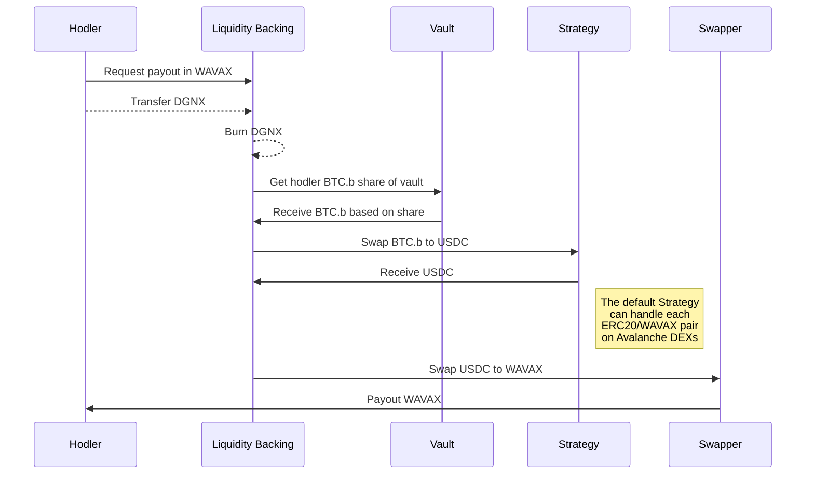
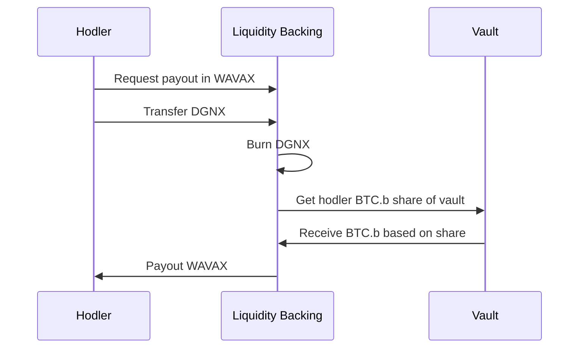

import ThemedImage from '@theme/ThemedImage';

# Products

<ThemedImage
  alt="Liquidity Backing Logo"
  className="vertical-timeline-element-title-img"
  sources={{
    light: ('/img/light_liqback.svg'),
    dark: ('/img/dark_liqback.svg')
  }}
/>

## How Does it Work?

Liquidity Backing is made up of several key components: Vaults, Strategies, Swappers, and the Controller. There are also two types of assets involved: Depositable assets and Want assets.

### Depositable Assets

These are the tokens you can put into the Liquidity Backing system. However, not just any asset can be added. It has to be approved by the DAO, and a thorough check is done to ensure any deposited asset can be withdrawn, either as the same type of asset or as a different ERC20 token.

### Want Assets

Want assets are the tokens you can get out of the system by trading in your DGNX tokens. The DAO decides which assets are available.

### Vaults

Think of Vaults as big piggy banks for the Liquidity Backing system.

They store the depositable assets and can be updated to change their functionality without moving the assets around. Only certain approved assets can be stored, and all important actions are protected so only the Liquidity Backing system can access them. The DAO has control over these vaults, including recovering accidentally deposited assets and adding new vaults.

### Strategies

Strategies are the plans for converting stored assets into another desired asset. They're designed to handle a range of assets and conversions, like turning any token into WAVAX, USDC, or WETH.e.

These strategies are fixed and can't be updated but can be replaced by the DAO. They know the target asset for conversion and are protected so only the Liquidity Backing system can use them.

### Swappers

Swappers are similar to Strategies but focus on converting one specific asset into another. While Strategies might convert multiple assets to WAVAX, Swappers could turn that WAVAX into a Want asset. Only the Controller can call on Swappers, and the DAO can add more if needed.

### Controller

The Controller is the central part of the Liquidity Backing system, coordinating all the parts. It handles tasks like asset deposits, payouts, and managing the various components (Vaults, Strategies, Swappers). It's designed to keep the system secure and ensure only the DAO can make significant changes.

Here is a full breakdown of tasks the Controller handles:
* Deposit Assets
* Disbursement of Want Assets
* Statistical information and metrics on Liquidity Backing
* Managing swappers
* Managing strategies
* Managing Vaults
* Managing of Want Tokens
* Managing of Deposit Tokens
* Managing of depositors of Deposit Tokens
* Checking mechanisms to ensure the integrity of the system

## Simplified Payout Example

To illustrate how payouts work, consider wanting to exchange your BTC.b stored in the vault for WAVAX:

1. You request a WAVAX payout from Liquidity Backing.
2. You transfer your DGNX to Liquidity Backing, which then burns it.
3. Liquidity Backing retrieves your share of BTC.b from the Vault.
4. It then uses a Strategy to swap BTC.b for USDC.
5. Finally, a Swapper converts the USDC to WAVAX, which is paid out to you.

### Simplified Payout Diagram

If we store BTC.b in our vault and want to have it paid out as WAVAX, strategies must ensure us that they can convert the asset into an assets that's handled by a DEX and if it is at least a swappable entity which can be swapped into WAVAX.

### Simplified Raw Payout Diagram

If we store BTC.b in our vault and want to have it paid out as WAVAX, strategies must ensure us that they can convert the asset into an assets that's handled by a DEX and if it is at least a swappable entity which can be swapped into WAVAX.

